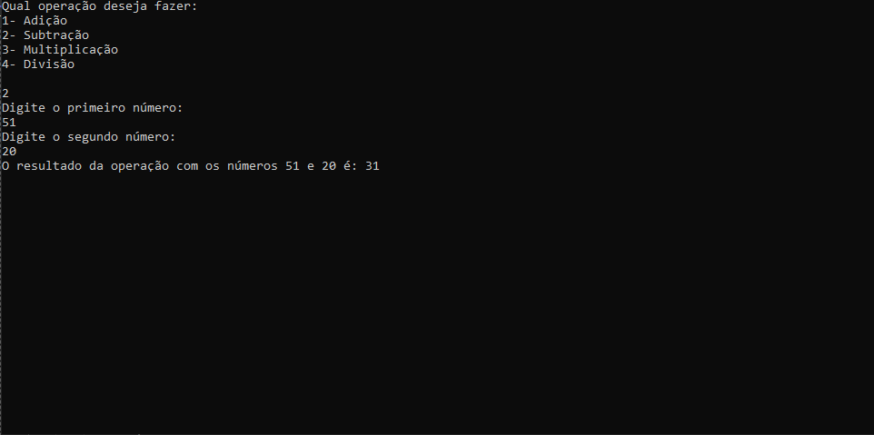

# Calculadora em C# 🧮

Este repositório contém uma calculadora simples implementada em C#. É um projeto ideal para quem está aprendendo os conceitos básicos da linguagem C# e deseja praticar suas habilidades de programação.

## Funcionalidades

- Adição
- Subtração
- Multiplicação
- Divisão

## Como Usar

1. Clone este repositório para o seu ambiente local.
2. Abra o projeto em seu ambiente de desenvolvimento preferido (por exemplo, Visual Studio).
3. Compile e execute o projeto.
4. Use a calculadora para realizar operações matemáticas básicas.

### Diego Neri
Linkedin: https://www.linkedin.com/in/diego-neri500/
